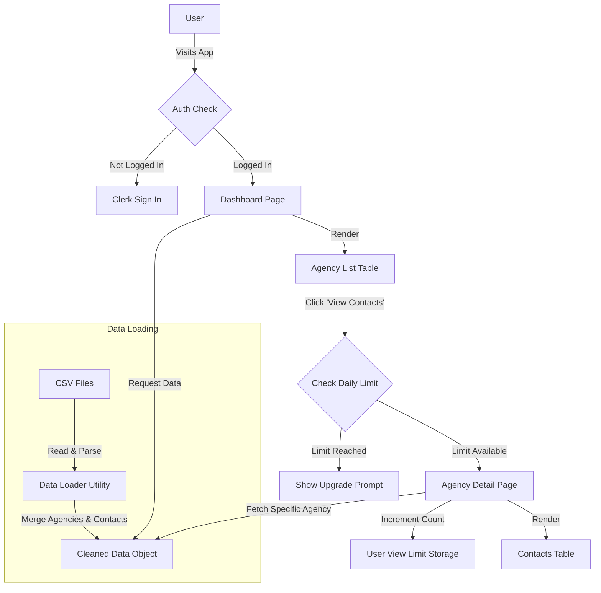

# Agency Portal Dashboard

A Next.js 16 application for viewing agency and contact information with view-limiting functionality. Built as a technical assignment.

## 🚀 Features

* **Authentication:** Secure user login via **Clerk**.
* **Data Parsing:** Server-side parsing of CSV data (Agencies & Contacts) with robust error handling.
* **View Limits:** Enforces a limit of 50 contact views per day per user.
* **Upgrade Prompt:** Displays a professional call-to-action when the daily limit is exceeded.
* **Responsive UI:** Clean, professional dashboard using Tailwind CSS.

## 🛠 Tech Stack

* **Framework:** Next.js 16 (App Router)
* **Auth:** Clerk
* **Styling:** Tailwind CSS
* **Language:** TypeScript
* **Deployment:** Vercel

## 📐 System Design

📦 How to Run Locally
Clone the repository

Bash

git clone [https://github.com/YOUR_USERNAME/YOUR_REPO_NAME.git](https://github.com/YOUR_USERNAME/YOUR_REPO_NAME.git)
cd YOUR_REPO_NAME
Install dependencies

Bash

npm install
Set up Environment Variables Create a .env.local file and add your Clerk keys:

Bash

NEXT_PUBLIC_CLERK_PUBLISHABLE_KEY=pk_test_...
CLERK_SECRET_KEY=sk_test_...
Run the development server

Bash

npm run dev